# Packlead

<p align="center">
	
</p>

<p align="center">
	
	
	
	
	
	
</p>

## Overview

Packlead is a Flutter mobile app for real-time order tracking. It supports two roles: admins who monitor operations and dispatchers who deliver orders with live location updates.

| | | | | |
| --- | --- | --- | --- | --- |
| 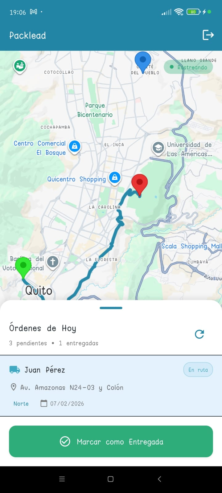 | 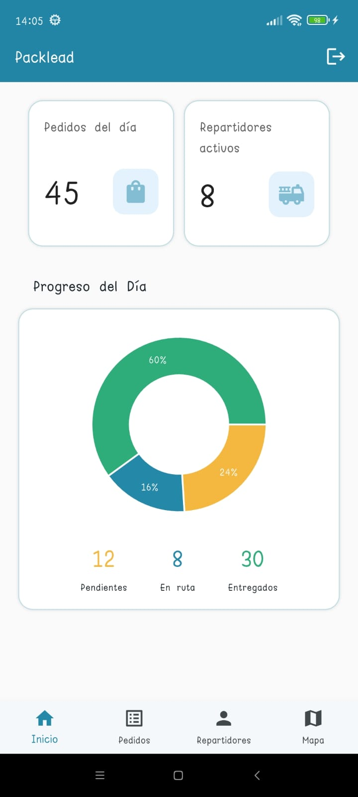 | 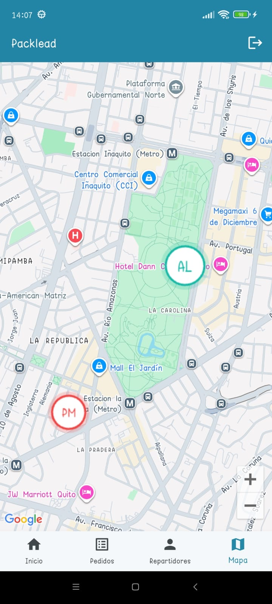 | 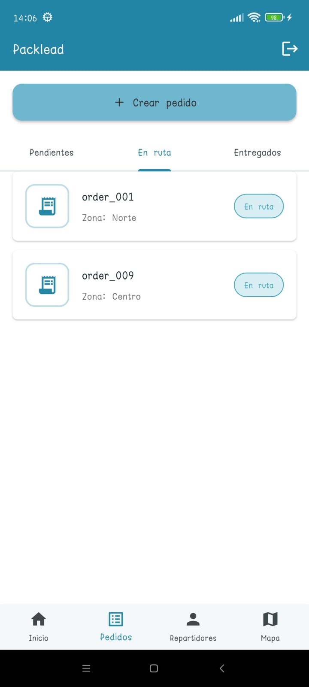 | 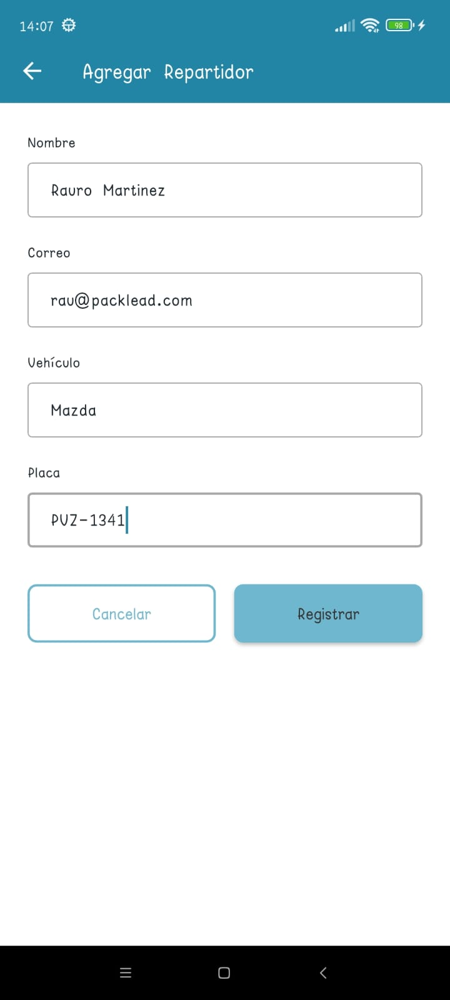 |
| 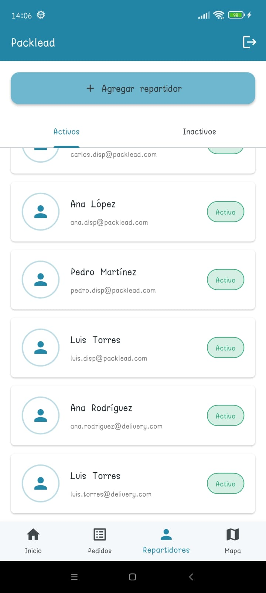 | 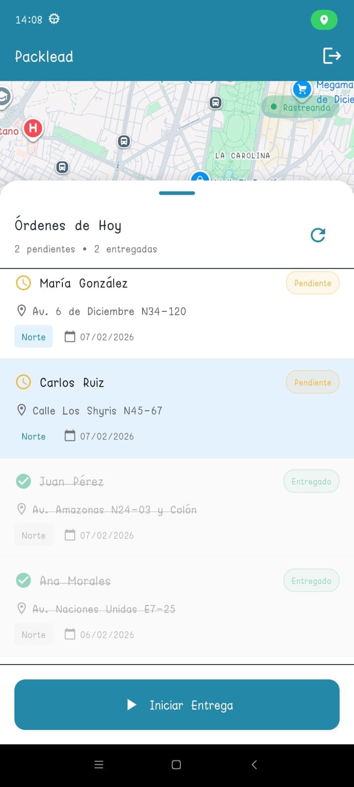 | 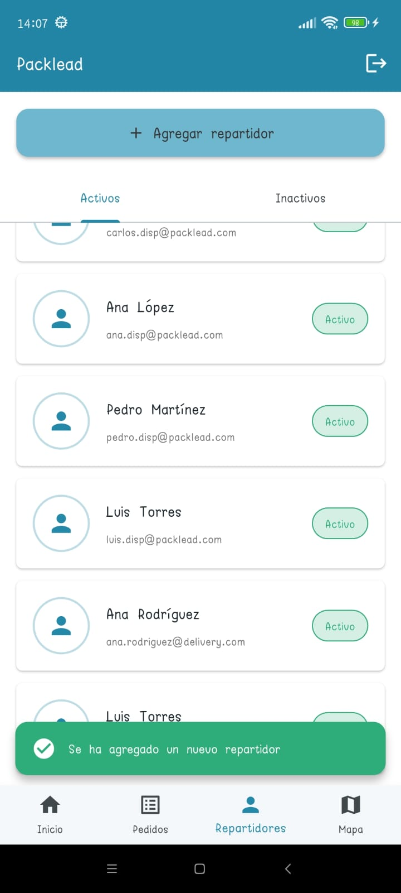 | 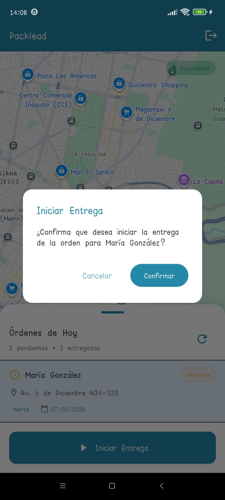 | 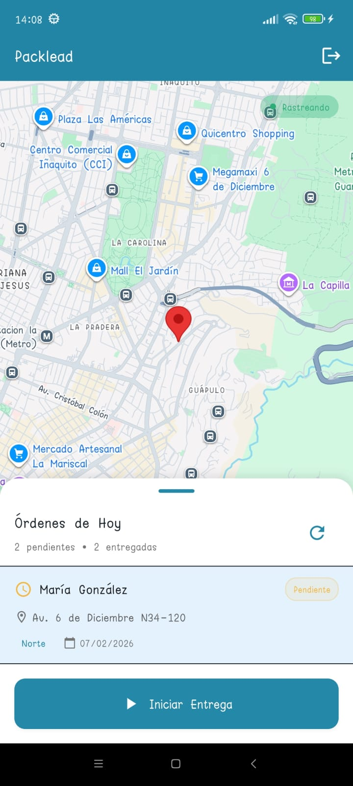 |

## Features

- Login flow with role-based access (admin and dispatcher).
- Admin views to manage orders, dispatchers, and live tracking on a map.
- Dispatcher view to see assigned orders, start deliveries, and share live location updates.

## Architecture

The app follows a feature-first structure with clear separation of concerns:

- Core layer for shared models, constants, themes, utilities, and base widgets.
- Feature modules (auth, admin, dispatcher, orders) with their own separation for data & state management.
- State management with Riverpod providers and notifiers.
- Services layer for external integrations (API, Firebase, location, maps).
- `mocks/` to support local testing and mock data flows.

Main lib/ structure:

```
lib/
├── core/
│   ├── config/          # Environment and app config
│   ├── constants/       # Enums and shared constants
│   ├── errors/          # App-specific error types
│   ├── models/          # Domain models (Order, Dispatcher, User)
│   ├── themes/          # Themes and styles
│   ├── utils/           # Helpers and formatting
│   ├── validators/      # Input validation
│   └── widgets/         # Reusable widgets
├── features/
│   └── [feature_name]/
│       ├── data/
│       │   ├── datasources/    # API and mock datasources
│       │   └── repositories/   # Repository implementations
│       ├── models/             # Feature-specific models
│       └── presentation/
│           ├── layouts/        # Layout scaffolds (feature specific)
│           ├── providers/      # Riverpod providers
│           ├── screens/        # UI screens
│           ├── state/          # UI state objects (feature specific)
│           └── widgets/        # Feature widgets
├── mocks/              # Test data and mock sources
├── services/
│   ├── api/            # HTTP clients and API config with DIO
│   ├── firebase/       # Firebase and RTDB services
│   └── location/       # Device location tracking
├── firebase_options.dart  # Firebase platform options
├── home_builder.dart      # Role-based app entry
└── main.dart              # App bootstrap
```

## Data Flow Diagram


## Integrations

- Firebase (Realtime Database) for authentication and live dispatcher location tracking.
- Google Maps for route display and real-time map visualization.

## Setup

Follow these steps to run the project locally:

1. Configure environment variables and generate config files.
	- Create or update the `.env` file with Firebase, Google Maps, and API values.
	- Run the setup script:

```bash
dart scripts/setup_config_files.dart
```

2. Install Flutter dependencies:

```bash
flutter pub get
```

3. Generate a release APK:

```bash
flutter build apk --release
```